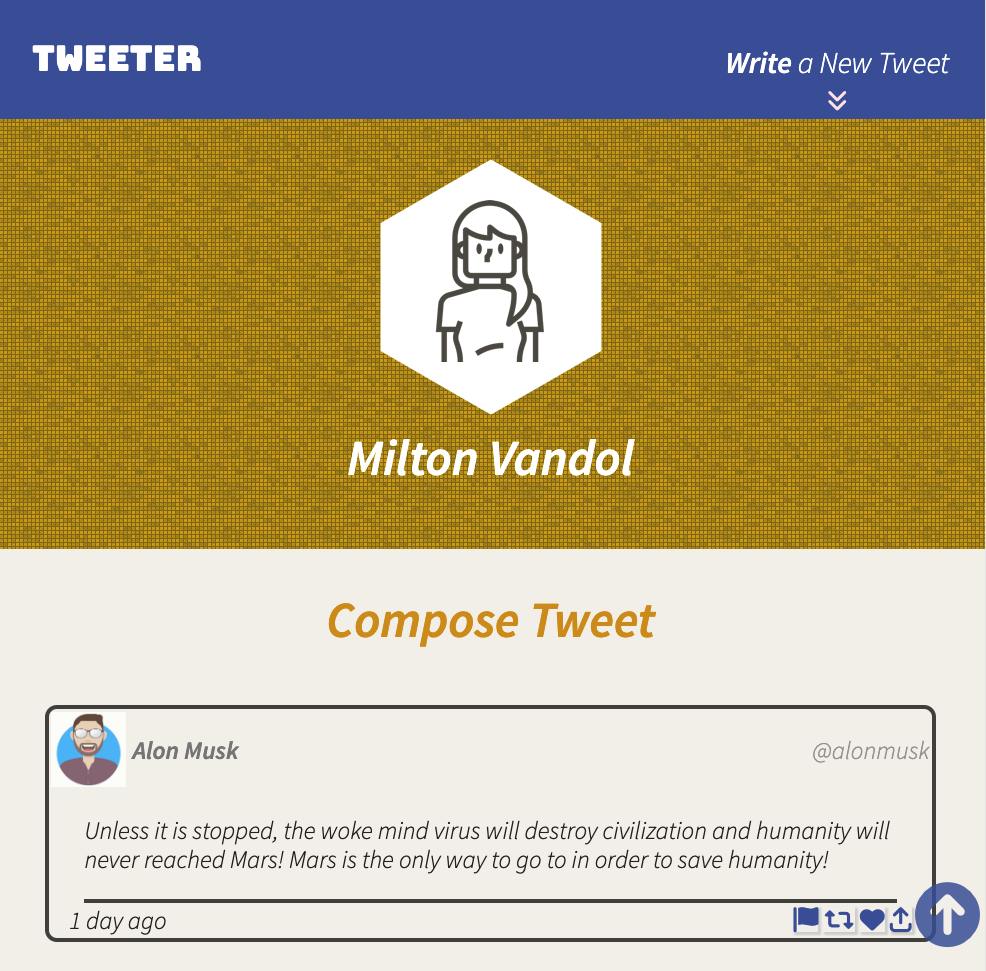
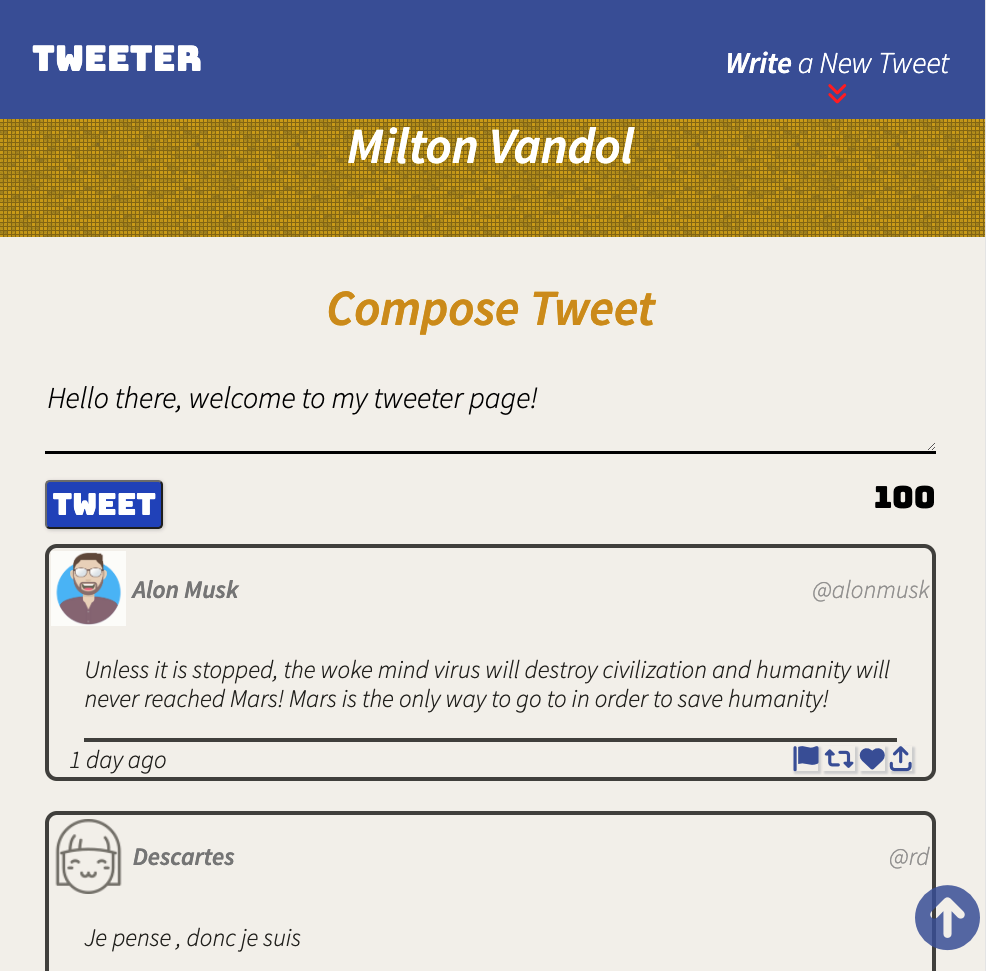
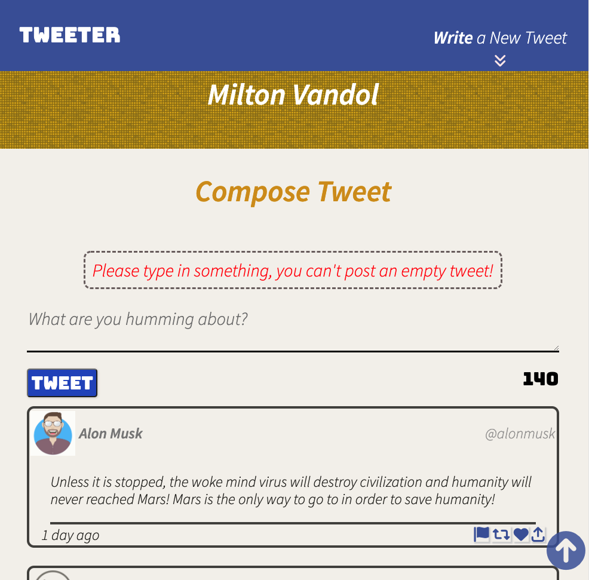
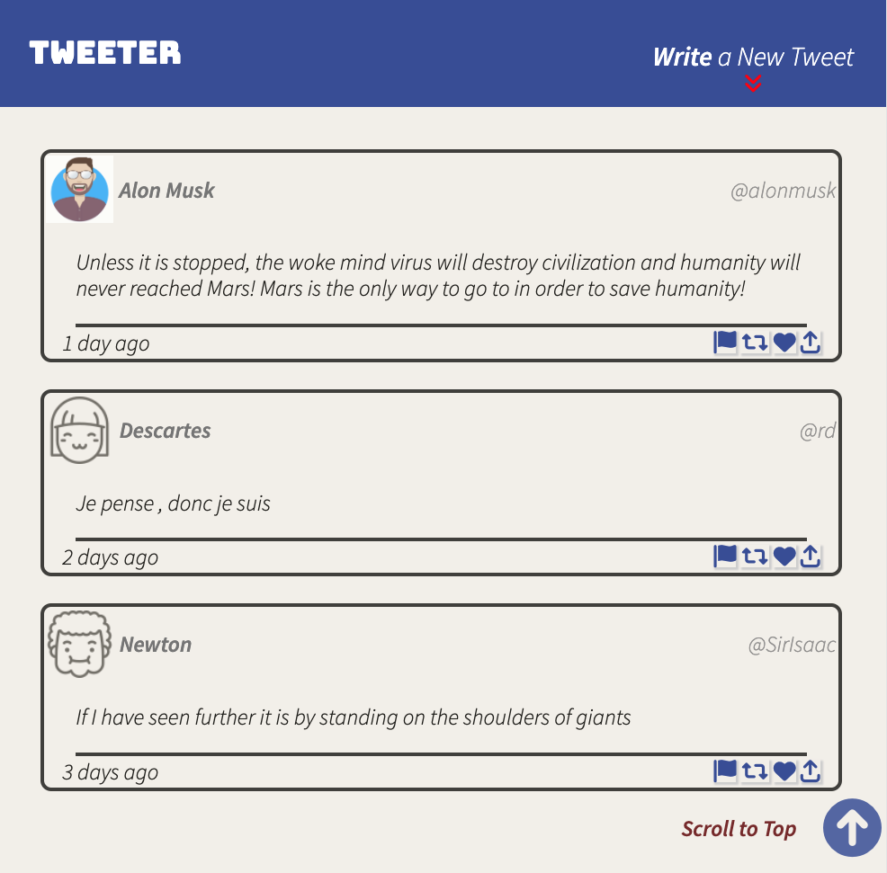

# Tweeter Project

Tweeter is a simple, single-page Twitter clone.

This repository is the starter code for the project: Students will fork and clone this repository, then build upon it to practice their HTML, CSS, JS, jQuery and AJAX front-end skills, and their Node, Express back-end skills.

## Getting Started

1. Create a new repository using this repository as a template.
2. Clone your repository onto your local device.
3. Install dependencies using the `npm install` command.
3. Start the web server using the `npm run local` command. The app will be served at <http://localhost:8080/>.
4. Go to <http://localhost:8080/> in your browser.

## Dependencies

- Express
- Node 5.10.x or above
- Body-parser
- Chance
- Md5

## Final Product
# App Layout for 1024px and Below
Landing Page

Writing a Tweet

Validation Error When Posting a Tweet

Bottom of Page

# App Layout for 1024px and Above
Landing Page
-Landing-Page.png)
Writing a Tweet
-Write-Tweet.png)
Validation Error When Posting a Tweet
-Validation.png)
Bottom of Page
-Bottom-Page.png)
